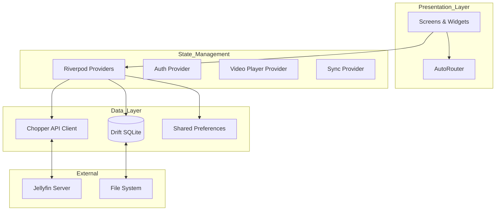
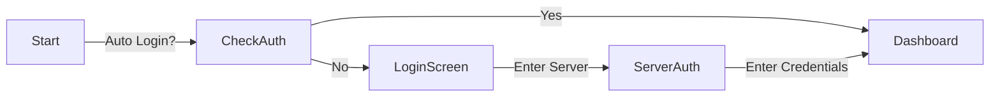

# Fladder Codebase Overview

This document provides a comprehensive analysis of the Fladder codebase, structured for Software Architects, Developers, and Product Managers. It covers system design, implementation details, and product feature evaluation.

## 1. Project Introduction
**Fladder** is a cross-platform Jellyfin client built with Flutter. It aims to provide a native, high-performance media streaming experience on Mobile (Android/iOS), Desktop (Windows/macOS/Linux), and Web.

## 2. Software Architect Perspective

### System Design & Architecture
Fladder follows a **Layered Architecture** driven by **Riverpod** for state management and dependency injection. The app is designed to be offline-first capable (via Drift/SQLite) and highly adaptive to different form factors.

#### Architectural Layers
1.  **Presentation Layer**: Flutter Widgets, Screens, and Riverpod Consumers. Handles UI rendering and user interaction.
2.  **Application Layer**: Riverpod Providers (`lib/providers`). Bridges UI and Data layers, managing application state (User Session, Player State, Sync Status).
3.  **Data Layer**:
    *   **API Client**: `Chopper` + `Swagger` generated code for communicating with Jellyfin servers.
    *   **Local Persistence**: `Drift` (SQLite) for offline content and syncing.
    *   **Platform Services**: Wrappers for native functionality (Video Player via `media_kit`, System integration).

#### Architecture Diagram


### Scalability & Performance
*   **State Management**: Riverpod's granular provider system prevents unnecessary rebuilds and ensures scalable state management as features grow.
*   **Networking**: `Chopper` combined with `connectivity_plus` ensures robust network handling. The architecture supports switching between local and remote URLs dynamically.
*   **Media Playback**: Uses `media_kit`, which leverages native video rendering (mpv/mdk) for high performance, avoiding Flutter's rendering bottleneck for video.
*   **Modularity**: Feature-specific providers (e.g., `video_player_provider`, `sync_provider`) keep logic decoupled.

## 3. Software Developer Perspective

### Code Structure
The codebase is organized by feature type rather than strictly by layer in some areas, but largely follows a standard Flutter project layout.

*   **`lib/main.dart`**: Entry point. Sets up `ProviderScope`, `AutoRouter`, and global overrides.
*   **`lib/providers/`**: The core business logic. Contains state notifiers and logic for Auth, Player, etc.
*   **`lib/screens/`**: UI pages. Organized by feature (e.g., `details`, `dashboard`).
*   **`lib/models/`**: Data classes, primarily using `freezed` for immutability.
*   **`lib/jellyfin/`**: Generated Swagger API client code.
*   **`lib/routes/`**: Navigation configuration using `auto_route`.

### Key Implementation Details

#### 1. API Client (`lib/providers/api_provider.dart`)
Uses `Chopper` with custom interceptors (`JellyRequest`) to inject authentication headers and handle dynamic base URLs.
```dart
// Simplified flow
Provider -> JellyApi -> JellyRequest Interceptor -> Chopper Client -> Jellyfin Server
```

#### 2. Video Player (`lib/wrappers/players/`)
Abstracted via `BasePlayer` class. Implementations wrappers around `media_kit` for cross-platform support.
*   **Logic**: `VideoPlayerNotifier` (Provider) manages the player instance and UI state.

#### 3. Offline Sync (`lib/providers/sync_provider.dart`)
Leverages `Drift` for storing metadata and `background_downloader` for media files. This is a complex subsystem ensuring content is available without internet.

### Data Flow

```mermaid
sequenceDiagram
    participant User
    participant UI as Widget
    participant Prov as Provider
    participant API as Jellyfin API
    participant DB as Local DB

    User->>UI: Request Content
    UI->>Prov: Watch/Read Provider
    alt Data Cached
        Prov->>DB: Fetch Local Data
        DB-->>Prov: Return Data
    else Fetch Remote
        Prov->>API: Get Data
        API-->>Prov: Return JSON
        Prov->>DB: Cache Data (Optional)
    end
    Prov-->>UI: Update State
    UI-->>User: Render Content
```


### Maintainability
*   **Code Generation**: Heavy use of `freezed`, `json_serializable`, and `riverpod_generator` reduces boilerplate but requires running build_runner (`dart run build_runner build`).
*   **L10n**: Robust internationalization support via `flutter_localizations` and `.arb` files in `lib/l10n`.
*   **Testing**: Basic test setup exists (`test/`), but coverage could likely be improved given the complexity of sync and player logic.

## 4. Product Manager Perspective

### Feature Set Evaluation
*   **Core**: Complete Jellyfin client (Browse, Play, Search).
*   **Differentiators**:
    *   **Offline Mode**: Download media for offline playback (Mobile/Desktop).
    *   **Cross-Platform**: Consistent UI across TV, Mobile, and Desktop.
    *   **Performance**: Native player backend outperforms web-wrapper clients.
*   **UX**: Adaptive layout handles different screen sizes gracefully. Theming engine (`dynamic_color`) integrates well with system preferences.

### User Flows
**Authentication Flow**:


### Actionable Insights & Recommendations
1.  **Onboarding**: The initial setup relies on the user knowing their Jellyfin server URL. Implementing local network discovery (mDNS/SSDP) would significantly improve the "first run" experience.
2.  **Music Support**: Currently, the focus is heavily on Video. Expanding the `BasePlayer` to handle audio-only queues better would make it a full media center replacement.
3.  **Documentation**: While the code is structured, developer documentation for the specific state management patterns (Riverpod v2 migration status) would help new contributors.
4.  **Testing**: Critical paths (Auth, Sync, Playback) should have automated integration tests to prevent regressions during updates.

---

*Generated by AI Assistant analyzing the Fladder repository.*


